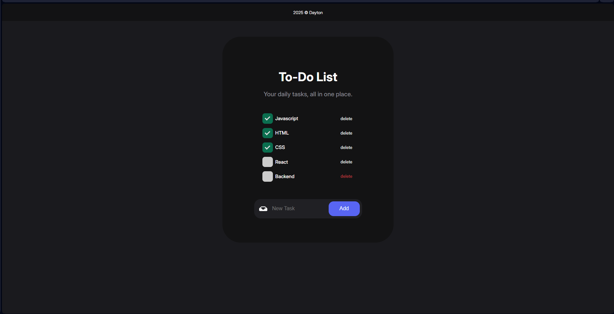

# 📝 Simple Persistent Task List

A simple and stylish to-do list app built with vanilla JavaScript. It lets users add, delete, and check off tasks — and all of this is **saved in localStorage**, so your tasks stay even after refreshing the page.

## 👨‍💻 About This Project

This project was built **entirely from scratch without following any tutorials or copying any code**. All logic and structure were self-designed based on the features I wanted. The only external element used is the **custom checkbox style**, which I found on [UIverse](https://uiverse.io/bociKond/spotty-elephant-13) by [bociKond].

## 🚀 Features

- ✅ Add tasks
- 🗑️ Delete tasks
- ☑️ Mark tasks as completed
- 💾 Data is saved in `localStorage`
- 🎨 Custom checkbox style from UIverse

## 📦 How It Works

- Tasks are stored in `localStorage` as an array of objects:
  ```js
  { text: "Buy groceries", checked: false }
  ```
  
